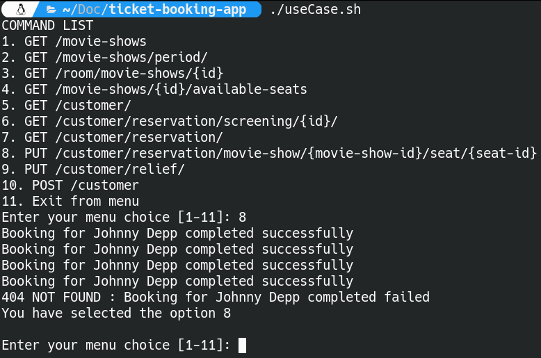

# Ticket booking app

### Built With

* [Java](https://www.java.com/en/)
* [Maven](https://maven.apache.org/)
* [Spring Boot](https://spring.io/)
* [JUnit5](https://junit.org/junit5/)


<!-- GETTING STARTED -->
## Getting Started

### Prerequisites

Download and install the software below

* [OpenJDK-18](https://openjdk.java.net/install/)


### Installation

1. Clone the repo
   ```git clone https://github.com/dg1asap/ticket-booking-app.git
   ```
2. Compile and run App with the .sh file
```
./buildAndRun.sh
```

## Demo

1. Run script for manual tests rest api
```
./useCase.sh
```


###The commands carry out the options listed below.

1. Returns a complete list of all movie shows available in the database
2. Returns the list of movie shows broadcast in a given period.
3. Returns information about the room number based on id of the movie show
4. Returns a list of bookable seats based on the id of the movie show
5. Returns information about a customer with given name and surname.
6. Returns information about the client's reservations of movie show with id
7. Returns all customer reservations
8. Make a reservation for the movie show
9. Sets a customer discount
10. Adds a new client



###Examples of REST API manual test paths:

Above is an example response from the service to operation number 8. With this operation we tried to reserve 5 seats for a screening for Johnny Depp. First 4 were successful. The 5th seat was a treatment to reserve a seat that is assigned to a different room. A more detailed description of the error can be found in the service console. After selecting option 8 again, we will no longer be able to book selected seats because they have already been booked by us. If we want to find out how much tickets in the shopping cart cost in total, we will use option number 5. Finally, we can display the list of available seats for the movie shows booked by us and check if there are any reserved seats on it. If we do not remember the id of the seats we have purchased, we can always check it with option number 6.

In another path, we can give Mr. Johnny Depp a student discount using option number 9. Purchase tickets with option number 8 and display the total of fees with option number 5. In this way, we compare the difference in purchasing tickets with and without discount.


<!-- LICENSE -->
## License

Distributed under the MIT License. See `LICENSE.txt` for more information.


<!-- CONTACT -->
## Contact

dg1asap - dg_1@wp.pl


